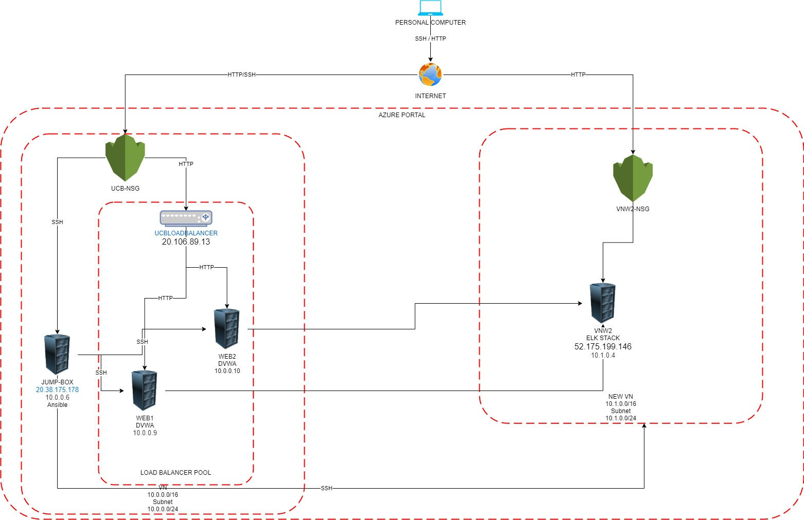
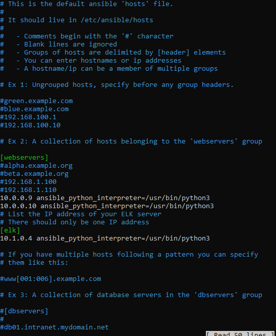
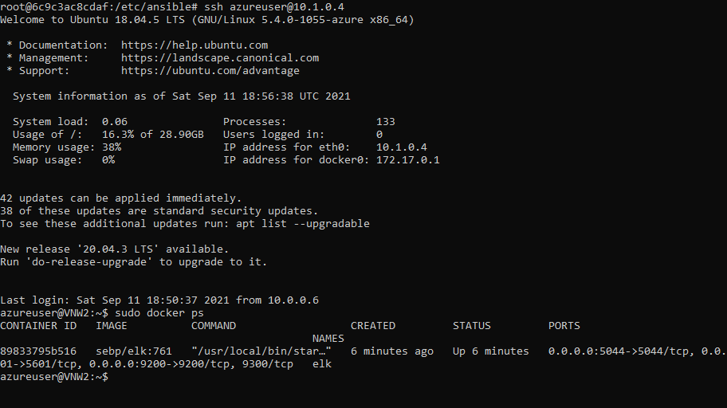

## Automated ELK Stack Deployment

The files in this repository were used to configure the network depicted below.

These files have been tested and used to generate a live ELK deployment on Azure. They can be used to either recreate the entire deployment pictured above. Alternatively, select portions of the play file may be used to install only certain pieces of it, such as Filebeat.

This document contains the following details:
- Description of the Topology
- Access Policies
- ELK Configuration
  - Beats in Use
  - Machines Being Monitored
- How to Use the Ansible Build

### Description of the Topology

The main purpose of this network is to expose a load-balanced and monitored instance of DVWA, the D*mn Vulnerable Web Application.

Load balancing ensures that the application will be highly redundant, in addition to restricting unwanted traffic to the network. DDOS 

Integrating an ELK server allows users to easily monitor the vulnerable VMs for changes to the jump box and system network.

The configuration details of each machine may be found below.

| Name     | Function | IP Address | Operating System |
|----------|----------|------------|------------------|
| JUMP     | Ansible Gateway  | 10.0.0.6   | Linux (ubuntu 18.04)          |
| WEB1      |    DVWA Container      |         10.0.0.9   |       Linux (ubuntu 18.04)           |
| WEB2     |       DVWA Container   |    10.0.0.10        |          Linux (ubuntu 18.04)        |
| VNW2     |       Elk Server   |      10.1.0.4      |           Linux (ubuntu 18.04)       |

### Access Policies

The machines on the internal network are not exposed to the public Internet. 

Only the JUMP machine can accept connections from the Internet. Access to this machine is only allowed from my personal home computer IP.

Machines within the network can only be accessed by _____.
- _TODO: Which machine did you allow to access your ELK VM? What was its IP address?_

A summary of the access policies in place can be found in the table below.

| Name     | Publicly Accessible | Allowed IP Addresses |
|----------|---------------------|----------------------|
| Jump Box | YES              |    66.215.95.213 |
|     WEB1     |      No                |        10.0.0.6              |
|       WEB2   |        No             |          10.0.0.6              |
|      VNW2  |          No           |           10.0.0.6             |

### Elk Configuration

Ansible was used to automate configuration of the ELK machine. No configuration was performed manually, which is advantageous because it allows all the VMs to be configured at once through an ansible playbook. 
After installing ansible to your vm, changing host configuration to match the IPs of the jumpbox before running the playbook is ideal.

The playbook implements the following tasks:
- Install docker
- Install pip3
- Install docker python
> 
    # Use apt module
    - name: Install docker.io
      apt:
        update_cache: yes
        name: docker.io
        state: present

      # Use apt module
    - name: Install pip3
      apt:
        force_apt_get: yes
        name: python3-pip
        state: present

      # Use pip module
    - name: Install Docker python module
      pip:
        name: docker
        state: present

      # Use sysctl module
    - name: Use more memory
      sysctl:
        name: vm.max_map_count
        value: "262144"
        state: present
        reload: yes
        
Picture of Elk Running looks like this

### Target Machines & Beats
This ELK server is configured to monitor the following machines:
WEB1     10.0.0.9 and WEB2 10.0.0.10

We have installed the Filebeat and Metric on these machines:
Filebeat is a lightweight shipper for forwarding and centralizing log data. Installed as an agent on your servers, Filebeat monitors the log files or locations that you specify, collects log events, and forwards them either to Elasticsearch or Logstash for indexing.
Metricbeat is a lightweight shipper that you can install on your servers to periodically collect metrics from the operating system and from services running on the server. Metricbeat takes the metrics and statistics that it collects and ships them to the output that you specify, such as Elasticsearch or Logstash.

### Using the Playbook
In order to use the playbook, you will need to have an Ansible control node already configured. Assuming you have such a control node provisioned: 

SSH into the Jump Box and follow the steps below:
- Copy the filebeat.yml file to /etc/ansible/roles
- Update the configuration file with changes to the IP address for the Kibana/elasticsearch hosts
- Create new ansible-playbook (filebeat-playbook.yml) that properly installs the filebeat.yml files
- Run filebeat-playbook.yml and go to ELK-Server to see if installation is successful. 
- go to http://[your.VM.IP]:5601/app/kibana and click on verify data after going through system logs.

